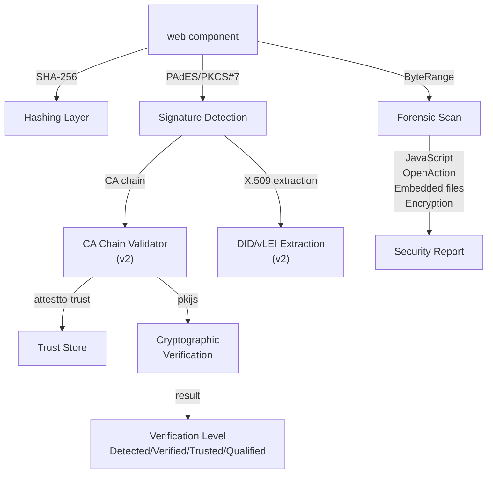

# @attestto/verify

[](https://www.npmjs.com/package/@attestto/verify)
[](./LICENSE)

> Web Components for document verification and signing. Drop a PDF — verify its integrity, digital signatures, and security properties entirely in your browser. No login. No backend. No data transmitted.

A zero-trust, client-side document verification suite built on W3C Web Components. Part of the [Attestto](https://attestto.org) identity infrastructure. Live at [verify.attestto.com](https://verify.attestto.com).

**[Documentation](https://attestto.org/docs/verify/)** · **[Playground](https://attestto.org/docs/verify/playground/)** · **[Quickstart](https://attestto.org/docs/quickstart/verify-a-document/)**

## Architecture



## Quick start

### Prerequisites

- Modern browser (Chrome, Safari, Firefox, Edge)
- No server or backend required

### Install

#### CDN (zero config)

```html
<script type="module" src="https://unpkg.com/@attestto/verify"></script>

<attestto-verify></attestto-verify>
```

#### npm

```bash
npm install @attestto/verify
```

```typescript
import '@attestto/verify'

// Use in HTML
// <attestto-verify></attestto-verify>
// <attestto-sign></attestto-sign>
```

### Try it

Drop a PDF on `<attestto-verify>` in your browser at [verify.attestto.com](https://verify.attestto.com). The component computes the hash, detects signatures, scans for security issues, and displays the results — all in your browser, locally.

## Components

### `<attestto-verify>`

Drop a document to verify its integrity, signatures, and security properties.

```html
<attestto-verify></attestto-verify>

<!-- deep-link mode: pre-fill hash from URL -->
<attestto-verify hash="sha256:a1b2c3..."></attestto-verify>
```

**Capabilities:**
- SHA-256 hash computation
- PAdES / PKCS#7 signature detection and metadata extraction
- SubFilter detection (`adbe.pkcs7.detached`, `ETSI.CAdES.detached`, `adbe.pkcs7.sha1`)
- ByteRange extraction for signature integrity audit
- Forensic security scan: JavaScript injection, OpenAction, embedded files, encryption type, external links
- Cryptographic verification via pkijs (ByteRange + CA chain math)
- LTV offline revocation checking (`/DSS` extraction)
- DID and vLEI identity extraction from X.509 certificates
- `did:pki` resolution via [resolver.attestto.com](https://resolver.attestto.com) for dynamic trust anchor lookup

**Attributes:**
- `hash` — Pre-filled hash for deep-link mode

**Events (composed, cross shadow DOM):**
- `verification-started` — `{ fileName, fileSize }`
- `verification-complete` — `{ hash, signatures, plugins }`

### `<attestto-sign>`

Sign documents with a browser-generated key or a DID wallet.

```html
<attestto-sign></attestto-sign>
```

Uses `@attestto/id-wallet-adapter` for wallet discovery. Produces a W3C `DocumentSignatureCredential` (Verifiable Credential) containing the document hash, signer's DID, and cryptographic proof. Browser-key signing uses WebCrypto ECDSA P-256 to produce a self-issued `did:key` credential.

### Composable API (headless)

All signing logic lives in `src/composables/document-signer.ts` — the component is UI only. Use the headless API for custom interfaces:

```typescript
import { hashFile, signWithBrowserKey, signWithWallet } from '@attestto/verify'

const hash = await hashFile(file)                    // SHA-256 as hex string
const result = await signWithBrowserKey(file, hash)  // { credential: VerifiableCredential }
```

## API / Key concepts

### Verification levels

| Level | Badge | Meaning |
|---|---|---|
| Detected | Amber | Signature structure found (v1 byte scan) |
| Verified | Green | Cryptographic math verified (v2) |
| Trusted | Blue | Chain reaches a recognized CA |
| Qualified | Gold | GLEIF vLEI — verified legal entity |

### Forensic security scan

Runs on local bytes. Nothing sent externally.

| Check | Safe | Warning |
|---|---|---|
| JavaScript | None found | Scripts detected |
| Auto Actions | None | OpenAction present |
| Embedded Files | None | Files attached |
| External Links | Count | URI actions |
| ByteRange | Offsets displayed | — |
| LTV Data | /DSS present | Requires online check |
| Encryption | None or AES-256 | RC4 (weak) |

## CSS Parts

Style any element from outside the shadow DOM:

```css
attestto-verify::part(drop-zone) {
  border-color: #your-brand;
}

attestto-verify::part(status-badge) {
  font-size: 0.8rem;
}

attestto-verify::part(vlei-badge) {
  background: gold;
}
```

| Part | Element |
|------|---------|
| `drop-zone` | File drop area |
| `result-card` | Results container |
| `hash-display` | SHA-256 hash |
| `sig-card` | Signature card |
| `status-badge` | Verification level badge |
| `signer-name` | Signer display name |
| `did-link` | DID URI |
| `vlei-badge` | GLEIF vLEI corporate identity |
| `corporate-info` | Organization row |
| `trust-level` | Level hint text |
| `audit-section` | Collapsible forensic audit |
| `audit-grid` | Audit data grid |
| `button` | Action buttons |

## Plugin system

Extend verification with custom trust sources. Plugins can only ADD trust signals — they cannot bypass the core integrity check (sandwich security rule).

```typescript
import { attesttoPlugins } from '@attestto/verify'

attesttoPlugins.register({
  name: 'my-custom-verifier',
  label: 'My Custom Trust Source',
  type: 'verifier',
  verify: async (hash, context) => {
    // Your verification logic
    return { valid: true }
  }
})
```

**Plugin types:** Parser, Crypto, Trust, Verifier

**Built-in plugins:**
- DID Verifier (`did:web`, `did:jwk` resolvers)

**CDN registration:**
```html
<script>
  window.Attestto.registerPlugin({ ... })
</script>
```

## Privacy

Your file never leaves your device. No login or account required. No telemetry, analytics, or tracking. The forensic scanner is 100% local. See [PRIVACY.md](./PRIVACY.md) for the full manifesto.

> The issuer knows who received the credential, but not where the user presents it. The verifier knows the credential is authentic, but trusts the math — not Attestto.

## Debug logging

Silent by default. Enable structured logging from the console:

```js
Attestto.debug = true
```

Logs are color-coded, numbered by step, and persist across page reloads (localStorage). Scopes: `sign`, `verify`, `plugin`, `wallet`.

## Development

```bash
pnpm install
pnpm dev          # Dev server at localhost:5173
pnpm test         # Run tests (19 passing)
pnpm format       # Prettier
pnpm build        # Production build
```

## Source layout

```
src/
  index.ts             — public exports, component registration
  components/          — Lit Web Components (<attestto-verify>, <attestto-sign>)
  composables/
    document-signer.ts — all signing logic (headless, framework-agnostic)
  plugins/             — built-in plugin implementations
  trust-store/         — bundled trust roots (uses attestto-trust)
  styles/              — component CSS
  logger.ts            — structured debug logger
  i18n.ts              — internationalization
  types.ts             — TypeScript interfaces
```

## Ecosystem

| Package | Role | Relationship |
|---|---|---|
| [`attestto-trust`](https://github.com/Attestto-com/attestto-trust) | PKI trust roots | Used by the CA chain validator for cryptographic verification |
| [`did-pki-resolver`](https://github.com/Attestto-com/did-pki-resolver) | DID resolution | Resolves `did:pki` identifiers for trust anchor matching |
| [`@attestto/id-wallet-adapter`](https://www.npmjs.com/package/@attestto/id-wallet-adapter) | Wallet discovery | Used by `<attestto-sign>` for DID wallet integration |
| [`@attestto-com/vc-sdk`](https://www.npmjs.com/package/@attestto-com/vc-sdk) | VC format | Provides `DocumentSignatureCredential` output format |
| [`attestto-anchor`](https://github.com/Attestto-com/attestto-anchor) | Solana anchoring | Verifies anchored hashes via plugin |

## LLM context

This repo ships a [`llms.txt`](./llms.txt) file — a machine-readable summary of the API, data structures, and integration patterns for AI coding assistants.

## Roadmap

- [x] Signature detection + forensic scanner
- [x] Cryptographic verification (pkijs + ByteRange + CA chain)
- [x] `did:pki` resolution and trust anchor matching
- [ ] Solana anchor verifier plugin
- [ ] vLEI Trust Plugin (GLEIF)

## Contributing

Contributions welcome. Please open an issue first to discuss breaking changes. All pull requests should include tests and pass `pnpm format` and `pnpm test`. The plugin system is the primary extension point — custom verifiers can be registered without modifying core code.

## License

Apache 2.0 — see [LICENSE](./LICENSE)

---

**verify.attestto.com** | **sign.attestto.com**

No data is transmitted. All verification happens in your browser.
